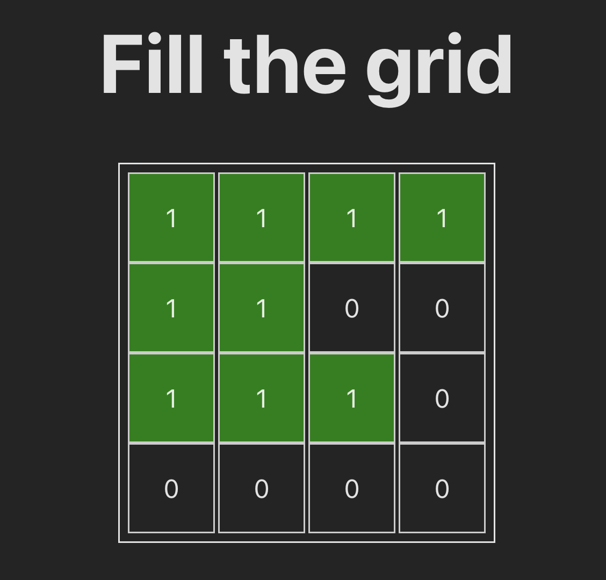

# Codekata - Fill the grid

**2024-03-28**

Fill the grid with blocks

## Challenge

- Grid should initialize with desired dimension
- Placing any input larger than grid itself should be rejected
  - On width
  - On height
- Placing any input smaller than grid itself should fit
- Placing additional input when grid is full should reject the input
- Placing multiple input should fit in the grid as long as there is space for the input
  - The block needs to be placed from left to right and top to bottom
  - Play with DEMO to understand the placement logic.

## Demo

https://stackblitz.com/edit/vitejs-vite-kklmmn?file=README.md

## Recording

https://inviqa.slack.com/archives/CG9RWK4LQ/p1711655838174379?thread_ts=1711635304.898359&cid=CG9RWK4LQ

## TDD

